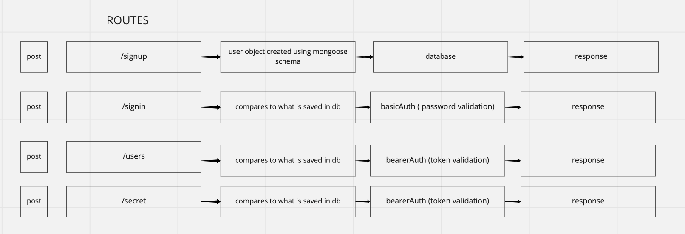

# Auth-Server
Started code provided. Task: debug and initialize.

## Background
Node app with an express framework that uses Mongo DB. Demonstrates user authentication with tokens. User record is instantiated on `/signup` usin g mongoose schema and saved to a collection.  Using virtuals, a token property and token value is created at `/signup` and added to the user object. A hook is used to save and hash password before saving user to DB.

Basic authentication middleware is used in the `/signin` route and bearer authentication is used in the `/users` and `/secret` routes.

## Setup
- Clone repo
- Create .env file and declare PORT and SECRET
- Npm init
- Download dependencies:
    `"@code-fellows/supergoose": "^1.0.11,"`
    `"base-64": "^1.0.0,"`
    `"bcrypt": "^5.0.1",`
    `"cors": "^2.8.5",`
    `"dotenv": "^8.2.0",`
    `"express": "^4.17.1",`
    `"jest": "^26.6.3",`
    `"jsonwebtoken": "^8.5.1",`
    `"mongoose": "^5.12.0",`
    `"morgan": "^1.10.0"`
- Establish local mongo db connection
- Go to inspector.swagger.io to test routes

## UML
